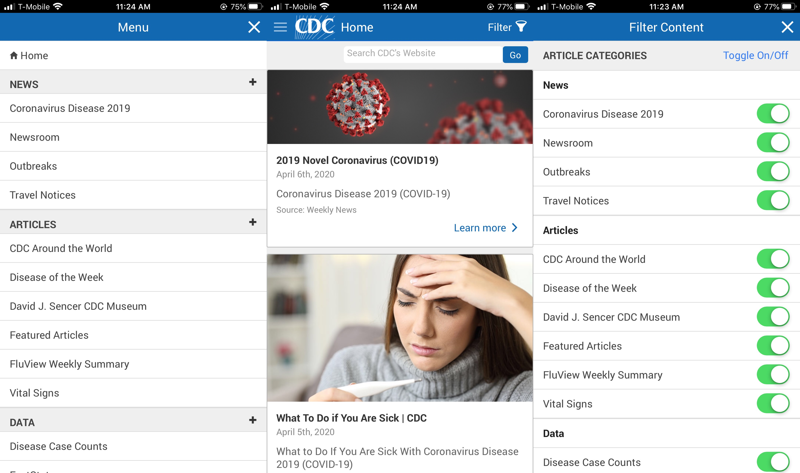
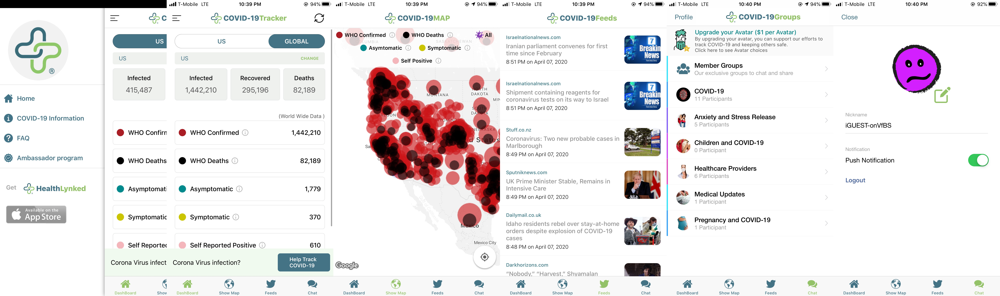

# UX Design for Pandemic Information for the Public
### DH150 Assignment01: Heuristic Evaluation by Amanda Ruan

#### Overall description about the project and my motivation:
In this assignment, I aim to focus on two public health mobile apps that feature information related to the pandemic COVID-19 for the public. One is the official app of CDC(Centers for Disease Control and Prevention), and the other app is called COVID-19Tracker, which is developed by HealthLynked Corp and updates worldwide COVID-19 information. Since early last quarter, I have been monitoring information related to the outbreak of the pandemic, including news, social media messages, and also relevant webpages, programs and apps developed for the public. CDC app and COVID-19Tracker app are two of the many apps I downloaded in the early days to track COVID-19 information. During this process of gaining information, I have observed many people, such as my friends and family, who were overwhelmed and confused by both the abundance of information on the Internet and the platforms that provide the information, as the platforms’ designs might not be user-friendly. I think it is important for the public to gain timely, clear, relevant, and true information through the uses of public health mobile apps and platforms, especially during this time. I hope I could contribute to the User Experience/Interface Design of these public health apps and propose suggestions for healthcare organizations to better help the public in acquiring pandemic-relevant information. 

## First App - CDC
### Information about the app:
- https://www.cdc.gov/mobile/applications/cdcgeneral/promos/cdcmobileapp.html
- This is the official app of the Centers for Disease Control and Prevention (CDC). CDC is a national public health institute of the United States and is also a U.S. federal agency. The CDC app provides public health information to the public. The app’s homepage features feeds of articles/news related to different public health information. The app has a navigation bar at the top, which contains a menu button and a filter button, and does not have tap bar at the bottom. Under the menu button, there are eight main sections, which are “return to home”, “news”, “articles”, “data”, “facts”, “journals”, “photos”, “audio”, “videos”, and “notifications”; each section contains lines of links, organized by themes, directed to different subpages. For instance, under the “news” section, a line of link is called “Coronavirus Disease 2019”, and under this subpage are CDC articles/news related to the COVID-19 information. 

### Motivation:
My motivation to explore the CDC mobile app is that CDC is the official source of COVID-19 related decisions, updates and information to the general public in the United States. The CDC app could be an important source for the public to gain pandemic information, and thus the usability design of the app is also important. I saw user comments in the App Store saying they couldn’t find information they want and that some links did not work. Acknowledge both the importance of this mobile app and its potential flaws in usability design, I want to use the 10 heuristics to evaluate the app with the hope to figure out if there is space for improvement in the app’s user experience design. 
### Overall Evaluation:
When I first downloaded the CDC app, I expected to see the format and layout of the app’s homepage similar to that of CDC website’ homepage, but it is not. The layout of the homepage is similar to a newsfeed; a user can scroll down to see different public health news/articles/subpages, which are organized into blocks. Two COVID-19 feeds are at the top. The overall experience is mildly friendly. The app is consistent in its choices of fonts, colors, and element sizes. The only two touch gestures required are tap and scroll, which are both intuitive and simple gestures. The app provides users with sufficient control and freedom, while it could provide more flexibility in user choices of content, error prevention and diagnose, and available search tools. It would also be better if it follows conventional mobile app layout to avoid additional cognitive load. Users might miss the menu button and be confused by the lack of home button if they do not take a look on the app thoroughly. 

## 1: Visibility of system status
- The app does provide appropriate and timely feedbacks during user interaction most of the time. One appropriate feedback is a progress indicator - a “loading” animation icon -when I clicked onto a link, so that I knew it took a little bit of time to go on to a new page. Another appropriate feedback design is the toggle icon for each filter content choice under the filter menu. For instance, I only wanted to see articles related to the coronavirus and clicked on the toggle icon next to the “Coronavirus Disease 2019” choice. The toggle icon allowed me to know whether I successfully “turned on” or “turned off” a filter choice. When users turn off all the filters and return to the homepage, there is no content and a notification box is shown notifying users that the content is filtered out. The app also displays a page title on the top bar to inform users which page they are on. These are all appropriate and timely feedbacks that allow users to be aware of the system status immediately.
- There is one minor problem with the CDC logo on the navigation bar at the top as the feedback might confuse users. When I was on the homepage, I tried to look for the app’s information page and I thought the logo could take me to there; but when I clicked onto it, it only changed color and nothing else changed. However, when I was on a subpage and clicked onto the same CDC logo, it took me back to the homepage. This inconsistency in feedbacks of the CDC logo icon might confuse users when they first encounter the app. However, it is not a very severe flaw because it does not affect users’ overall experience with the other elements in the app, and users can also figure this out on more trials. One solution of this problem is to create a home bottom at a common place, such as the bottom of the app. Severity Rating (2).

## 2: Match between system and the real world
- Most language choices and UI elements choices follow real-world conventions and speak the users’ language. For instance, the icons of the menu button, filter button, and home button are all identical to the icons used for these purposes. However, the language choices of some sub-sections under menu sections might cause confusion. For instance, the “Vital Signs” under “articles” section conveys an obscure meaning to me. I did not know what this section is actually about until I clicked on the link and found articles on various health topics such as childhood trauma prevention and Rabies. The sections might need a more descriptive name to avoid user confusion. Severity Rating (2). 

## 3: User control and freedom
- The app provides sufficient and appropriate freedom and control. There is a “back” button on every article page that allows users to “undo” their unwanted actions. For instance, when I clicked onto a random page that led to an external link of the article and I wanted to go back, there was always a tap bar at the bottom stating “back to the CDC app”, so that I could click onto that and go back. Severity Rating (1). 

## 4: Consistency and standards
- In terms of external consistency, the CDC app does not contain a bottom tap bar that most other apps have. When I first opened the app, I was confused as I was expecting a bottom tap bar that might contain different features, such as search tool or menu categories. Then I realized the menu button is next to the CDC logo and is embedded within the navigation bar at the top, which was hard to tell at first glance. This could add to users’ cognitive load when users explore the app as it is not consistent with the standards followed by most other mobile platforms. While users might get used to the app design, the overall experience could also be less comfortable because of the lack of tap bar. This experience is also persistent. Another problem similar to this one is the home button problem I mentioned before in #1 Visibility of System Status. These problems could be solved by making the menu bar more noticeable or creating a bottom tap bar that contained menu and home buttons. Severity Rating (2).

## 5: Error prevention
-	While the app provides appropriate and enough options for “undo”, it does not set any error prevention design before users committing the actions. For instance, on the homepage, there is a search bar at the top that allows users to type in information to search on the CDC’s website. When I was typing, the search bar did not prompt any suggestion for what I might be searching and did not correct any misspelling. So if users type a phrase wrong, it will still take users to the result page and users have to go back and change their search manually. Even though this is not a severe problem, it could waste users’ time in searching for information. Severity Rating (2). 

## 6: Recognition rather than recall
- The app does not indicate which articles a user has clicked into and read before, so the app does not help a user to recognize his/her viewing history or previously visited content. This might cause extra cognitive load if users want to know which articles they have read before but lose track of the articles. Severity Rating (2). 

## 7: Flexibility and efficiency of use
- The app does allow certain flexibility and efficiency for users, but the features might not be recognized and welcomed by novice users. The appropriate features included a “back to the top” icon when users are scrolling down along a page. An example of the drawback could be the filter feature. The filter button at the top of the navigation bar allows users to choose what article categories they want to see on their homepage and what they don’t want to see. However, someone who has not seen this feature before might not be able to know this app provides this flexibility. Thus, certain features might not be friendly to users who do not know the features. Severity Rating (2). 

## 8: Aesthetic and minimalist design
- The app follows a minimalist design as it does not contain any extra graphics or words. Section names are listed in short and plain text under the Menu page. Articles are displayed as blocks and each article was shown by a bold headline and a few lines of its content. However, some sections contained a lot of articles. It could be overwhelmed as the articles were not related to each other and were not sorted. The design of sections could be improved if there are filter feature, search feature, or sort feature that allow users to customize the displays of different articles. Severity Rating (2). 

## 9: Help users recognize, diagnose, and recover from errors
- The app does not provide any features that help users to recognize and diagnose from errors. For instance, the search bar does not auto-correct users’ misspelling and does not make suggestion to users’ search and solve the problems. Users need to make sure they do not make any typing mistakes or misspelling a disease’s name. Severity Rating (3). 

## 10: Help and documentation
- The about/information page was hard to find for users who are not familiar with the app, as it is at the bottom of the menu page. Users have to first figure out there is a menu button and then scroll down to the button to find the information page. In addition, the link to information page is small and the color is consistent with the other links above it, so it is not obvious enough and users might ignore it easily. Except for this flaw, the documentation was appropriate. It provides enough descriptions of the app and space for user feedbacks, as users can click on a link under the page and directly email the developer. Severity Rating (2). 

## Second App – COVID-19Tracker 
### Information about the app:
- https://apps.apple.com/us/app/healthlynked-covid-19-tracker/id1500575377
- This is an app developed by HealthLynked Corp that provides information specific to the pandemic COVID-19. HealthLynked Corp is a cloud-based platform for healthcare providers and patients’ networks and medical information. The app updates and shows both country-level and city-level spread of COVID-19 on a world map based on both WHO data and users’ self-reported data. The app has a tap bar at the bottom and a navigation bar at the top. The app contains four main subpages indicated by the four buttons on the tap bar; the pages are “dashboard”- provides both U.S. and global numbers of cases, “show map”- visual representations of COVID-19 numbers on a world map, “feed”- updates COVID-19 related news from a variety of global news websites, and “chat”- provides group chats with topics such as “anxiety and stress release” and “healthcare providers”.

### Motivation:
I’m motivated to evaluate this app because this is one of the very early fully developed mobile apps I found on COVID-19 tracking. Many COVID-19 tracking sites I found were website-based or mini programs/pages within an app, instead of a fully developed app. I’m really interested in the overall design of the app, such as the layout, elements, and control, and how users might navigate information on the app. This app is also similar to my preliminary project idea of creating an app that provides pandemic information and is easily accessible by the public. 
### Overall Evaluation:
Overall, this app provides appropriate degree of usability design while certain aspects can still be improved. When I first used the app, I was confused by the map page and different labels that represent different types of COVID-19 cases, so I think an information/help box on the page would be really helpful if it can explain the content and show new users how to navigate the map. Search bars and chat feature related to errors management could also be improved. Besides these flaws, the aesthetic design was good as the information is easy to follow and the color scheme is comfortable to look at. Except for the map page that might require users to have previous experience (different touch gestures: pinch and spread) in interacting with a map tool, the app implements simple and intuitive touch gestures - tap and scroll, so that users’ interaction with the interface is easy and convenient. The four main pages also present clear functionalities and features that are easy to follow once users become familiar with the interface. 

## 1: Visibility of system status 
- The system provides appropriate and timely feedback during user interaction. For instance, when I was on the “DashBoard” page, the “DashBoard” icon color was different from the rest of the icons on the bottom tap bar, suggesting that I’m on the “DashBoard” page. Additionally, when I clicked onto a bubble (which represents a county/city/country) on the map, information box displaying confirmed cases, recovered cases and deaths was shown to indicate that I successfully clicked onto the bubble. Thus, I was able to know what’s going on with my interaction with the app. 

## 2: Match between system and the real world
-	The app uses language that is understandable to the public and also uses UI elements that matches the real world. The data/numbers were represented in Arabic numerical that are universal understandable. In addition, the icons of the “show map” and “chat” buttons are also universally recognizable and are consistent with the meanings of the two names, so users would not be confused when seeing the icons and the names.
-	A concern might arise related to the visual representations of numbers of cases on the map. For each city or country, a bubble was shown to indicate the number of cases from that city/country. The bubble is bigger if there are more cases in the city/county. However, the bubbles might not reflect the actual conditions in the city/country since the app does not show data related to smaller units, such as neighborhoods or streets. Thus, the bubbles might generate a misleading impression on the conditions of the spread of actual cases. A solution to this problem could be adding explanation in addressing the flaws of the visual representation that users might not be aware of. Severity Rating (2). 

## 3: User control and freedom
-	There are clear marks of “exit” and “back” on some of the pages but not all of the pages. For instance, the four main pages “DashBoard”, “Show Map”, “Feed”, and “Chat” do not contain an “undo” or “back” option, and users need to manually click onto the icons of these pages as a substitute of “undo”. Severity Rating (1).

## 4: Consistency and standards
-	The app maintains an internal consistency with the choices of fonts, sizes and colors. For instance, the color of the dot for “WHO confirmed” is red on the “DashBoard” page, and the color is the same in the “Show Map” page. I was not confused by the colors when I switched the pages. The app also maintains an external consistency by using the words/phrases and icons that were consistent with other platforms. For instance, the “chat” page icon, features and layout are similar to those of other social media apps, so it was easy for me to comprehend how to use the chat page. 

## 5: Error prevention
-	The app does provide certain error prevention but not in all aspects. For instance, an appropriate error prevention message was shown when I entered an incomplete email address stating “invalid email address”. However, it did not automatically detect whether certain domain names were valid or not and display error messages. I could still type in a wrong email address with a nonexistent domain name. In addition, the “Feed” page news links automatically take users to external news websites without any warnings, so users have to go back to the app manually after clicking on the news. Severity Rating (2). 

## 6: Recognition rather than recall
-	The “Feed” page keeps updating news from different news sites across the world but does not provide features that allow users to see their viewing and clicking history. Adding this feature could be helpful for users to remember what information they have seen before and easier for users to find the articles when they need, while a lack of this feature might lead to information overload and it would be difficult for users to memorize the information they have seen. Severity Rating (3).

## 7: Flexibility and efficiency of use
-	The app does provide certain degree of flexibility and efficiency. For instance, old users would know that they are able to change the country that displayed at the “DashBoard” page by clicking the “change” link. While the countries were listed in alphabetic order, a search bar allows users to type in the name of a country directly and skip scrolling up and down to search for the country. A novice user can also catch up with this feature. On the “Feed” page, users can both scroll by finger or drag the sidebar to go up and down along the page. These are examples of the flexibility and efficiency provided by the app.
-	There are features that were not very friendly. The “Feed” page does not provide a back to top button. Under the map page, old users would know that they can view one type of cases at a time (such as WHO death) by clicking onto the label, while novice users might find it hard to navigate through the map at the first time. An information bar/icon/box could be added to allow new users to understand how to navigate through the map. Severity Rating (2).

## 8: Aesthetic and minimalist design
-	The app does not contain any information that is irrelevant or seldomly needed. The UI elements are appropriate and all the information is layout in a visual appealing and clear way. The only problem could be similar to the one on CDC website, which is the “Feed” page. The page contained too many news information from different news websites across the world. Even though the layout is pleasing, but the information itself could be overwhelming to users. Tools or features such as sort by news agencies or regions could be helpful for users to search for more relevant information on the app. Severity Rating (2). 

## 9: Help users recognize, diagnose, and recover from errors
-	One design that satisfies this heuristic is the search bar for countries under the “DashBoard” page provides error messages that helps users to recognize and recover from errors. When I typed in a letter or two letters, the search bar automatically displays all country names that contained the letters for me to choose, which helped me to recognize my potential typing errors and also fix the errors along the way. 
-	A design that does not satisfy this heuristic is under the “chat” page, where users cannot recall/modify/delete their messages after they send out. The app does not offer solutions to fix the accidental sent messages or wrong messages. This is a persistent problem and might lead to serious problems when the messages were incorrect. Severity Rating (3).

## 10: Help and documentation
-	The app provides appropriate degree of help and documentation while it could also be improved. There is information icon beside each type of COVID-19 cases to show users the definition of each type, such as the type “Symptomatic”. Additionally, under the FAQ button on the app’s menu page, it lists the sources of the data the app uses. The listing could also be improved if it provides links to those sources. Severity Rating (1).
-	In addition, as I mentioned in #8 Aesthetic and Minimal Design, a helper tool on the “Feed” page, such as a search bar or filter bar, could be valuable for users to further search for and sort information/news they need. Severity Rating (2). 

